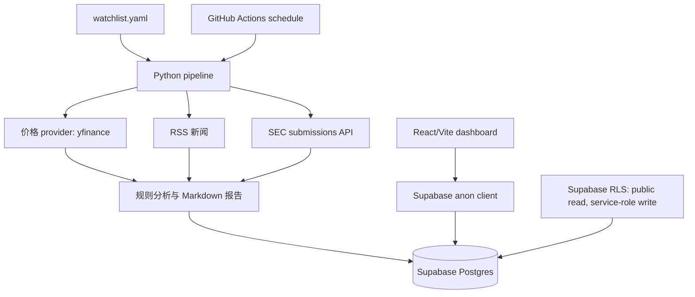

# Investment Intel

个人投资情报日报系统。它每天读取 `watchlist.yaml`，抓取持仓和相关 ticker 的价格、RSS 新闻与 SEC filings，做规则化去重、相关性判断和影响分类，生成适合手机阅读的 Markdown 日报，并写入 Supabase。前端是 Vite + React + TypeScript 的手机优先 dashboard。

本项目只做信息整理，不做自动交易，也不提供具体买卖建议。

## 架构图



## 本地开发

```bash
python -m venv .venv
source .venv/bin/activate
python -m pip install -r requirements.txt
cp .env.example .env
cp watchlist.example.yaml watchlist.yaml
```

Windows PowerShell 激活虚拟环境：

```powershell
.\.venv\Scripts\Activate.ps1
```

## 创建 Supabase 项目

1. 在 Supabase 控制台创建新项目。
2. 在 Authentication 中创建或邀请你自己的用户，用于 pipeline 写入数据时绑定 `user_id`。
3. 复制该用户的 `id`，写入 `.env` 的 `SUPABASE_USER_ID`。
4. 在 Project Settings -> API 中复制：
   - `Project URL` 到 `SUPABASE_URL`
   - `service_role` key 到 `SUPABASE_SERVICE_ROLE_KEY`
   - `anon public` key 到 `web/.env` 的 `VITE_SUPABASE_ANON_KEY`

## 执行 migration

安装并登录 Supabase CLI 后，在项目根目录执行：

```bash
supabase login
supabase link --project-ref your-project-ref
supabase db push
```

migration 位于 `supabase/migrations/`。`0001_initial_schema.sql` 会创建 `holdings`、`related_assets`、`news_items`、`sec_filings`、`daily_reports`、`price_snapshots`，并为所有表启用 RLS。`0002_public_read_dashboard.sql` 会为公开 dashboard 开启匿名只读访问。

## 配置环境变量

后端 `.env`：

```bash
SUPABASE_URL=...
SUPABASE_SERVICE_ROLE_KEY=...
SUPABASE_USER_ID=...
WATCHLIST_PATH=watchlist.yaml
REPORT_DATE=
DRY_RUN=false
SEC_USER_AGENT=InvestmentIntel/0.1 your-email@example.com
```

前端 `web/.env`：

```bash
VITE_SUPABASE_URL=...
VITE_SUPABASE_ANON_KEY=...
```

不要把真实 `.env` 或 `web/.env` 提交到仓库。

## 配置 watchlist

```bash
cp watchlist.example.yaml watchlist.yaml
```

然后按你的持仓、相关 ticker、相关公司、主题和关键词修改 `watchlist.yaml`。示例只使用公开 ticker，不包含真实持仓数量。

## 运行 pipeline

完整日报流程：

```bash
python -m pipeline.main run-daily
```

单独运行某一步：

```bash
python -m pipeline.main sync-watchlist
python -m pipeline.main fetch-prices
python -m pipeline.main fetch-news
python -m pipeline.main fetch-sec
python -m pipeline.main generate-report
```

本地只验证流程、不写 Supabase：

```bash
DRY_RUN=true python -m pipeline.main run-daily
```

## 运行前端

```bash
cd web
cp .env.example .env
npm install
npm run dev
```

前端不要求登录。dashboard 使用 Supabase publishable/anon key 公开只读数据；写入仍只能由 Python pipeline 使用 service role key 完成。

## GitHub Actions

workflow 位于 `.github/workflows/daily-intel.yml`。它会每天 `06:30 UTC` 运行一次，并支持手动 `workflow_dispatch`。

需要配置 GitHub Secrets：

- `SUPABASE_URL`
- `SUPABASE_SERVICE_ROLE_KEY`
- `SUPABASE_USER_ID`

建议配置 GitHub Variables：

- `WATCHLIST_PATH=watchlist.yaml`
- `SEC_USER_AGENT=InvestmentIntel/0.1 your-email@example.com`

## 数据安全

- `SUPABASE_SERVICE_ROLE_KEY` 只能用于 Python pipeline 和 GitHub Actions。
- 前端只能使用 `VITE_SUPABASE_ANON_KEY`，绝不能使用 service role key。
- 所有业务表已启用 RLS。
- anon 用户只有 select 权限，用于公开 dashboard。
- authenticated 用户的 insert/update/delete policy 都限制为 `auth.uid() = user_id`。
- service role 会绕过 RLS，用于定时任务写入。

## 后续扩展

- LLM 新闻摘要和 filing 摘要。
- Telegram 或 Email 推送。
- 更多新闻源和公告源。
- 更完整的 SEC 原文解析。
- 估值模块。
- 事件复盘模块。
- 可替换行情 provider 和缓存层。
